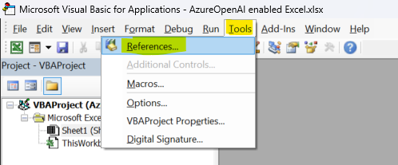
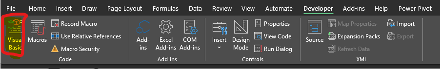
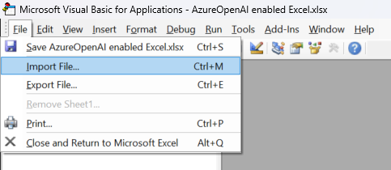
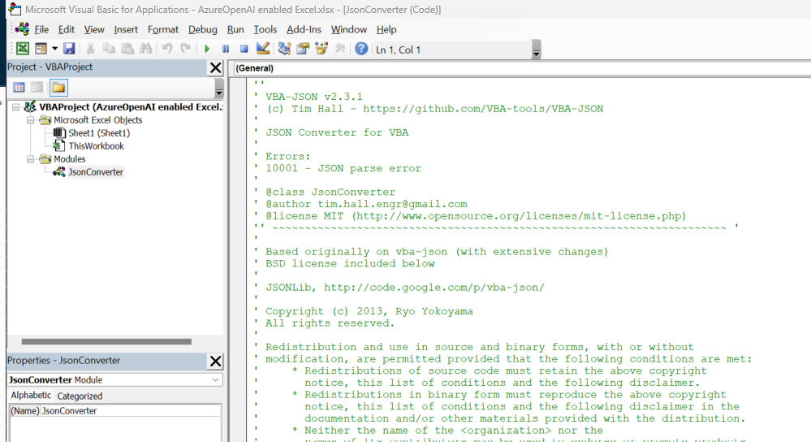

# Azure OpenAI Enabled Excel

## :loudspeaker: Introduction
This repo is about adding a custom function in Excel file to enable API call to Azure OpenAI Service, providing the user a secured channel of leveraging the power of the advanced OpenAI models in their Excel data, without worring about the data being used to retrain the model. 

## prerequrisites:
1. Access to an Azure OpenAI Service instance as well as its API endpoint and API key
2. Authorization in your organization to enable developer capabilities and use macros in Excel.
3. Download the Excel file to your local machine [AzureOpenAI enabled Excel.xlsx]

## How To

1. Open the Excel file you downloaded and enable the “developer” menu. This can be done in File → Options → Customize Ribbon:


2. Open VBA editor and add 2 references intot the VBAProject "Tools":

- Microsoft XML, v6.0
- Microsoft Scripting Runtime


2. Add the JsonConverter module to be able to parse the JSON response from the Azure OpenAI API:
   - Go to https://github.com/VBA-tools/VBA-JSON/releases and download the latest zip file version
   
   - Extract the file
   
   - Go to VBA editor under the Developer Tab:
   
   - In Excel's VBA editor, import the JsonConverter.bas file as a module
   
   
   
3. Insert a new module and paste the code below to create the function **AOAIGPT**:


```VBA
' This function takes one string input as the user prompt
Function AOAIGPT(userPrompt As String) As String

Dim apiKey As String
Dim apiEndpoint As String
Dim modelDeploymentName As String
Dim systemMessage As String
Dim temperature As Single
Dim maxTokens As Integer
Dim URL As String

' Set the API parameters from the "parameters" sheet
apiEndpoint = Worksheets("Parameters").Cells(1, "B").Value
apiKey = Worksheets("Parameters").Cells(2, "B").Value
modelDeploymentName = Worksheets("Parameters").Cells(3, "B").Value
systemMessage = Worksheets("Parameters").Cells(4, "B").Value
temperature = Worksheets("Parameters").Cells(5, "B").Value
maxTokens = Worksheets("Parameters").Cells(6, "B").Value

Set req = New MSXML2.ServerXMLHTTP60

' Create the API request
URL = apiEndpoint & "openai/deployments/" & modelDeploymentName & "/chat/completions?api-version=2023-07-01-preview"

req.Open "POST", URL, False
req.setRequestHeader "Content-Type", "application/json"
req.setRequestHeader "api-key", apiKey
    
' Create the JSON request payload with user prompt and other parameters
Dim jsonRequest As String
jsonRequest = "{""messages"": [{""role"": ""system"",""content"": """ & systemMessage & """},{""role"": ""user"",""content"": """ & userPrompt & """}],""temperature"": " & temperature & ",""top_p"": 0.95,""frequency_penalty"": 0, ""presence_penalty"": 0,""max_tokens"":" & maxTokens & ",""stop"": null}"

req.send jsonRequest

' Check for a successful response (you should add more error handling)
If req.Status = 200 Then
    ' Parse the JSON response and extract the completion text
    Dim jsonResponse As Dictionary
    Set jsonResponse = JsonConverter.ParseJson(req.responseText)
    ' Extract the "content" from the first choice
    AOAIGPT = jsonResponse("choices")(1)("message")("content")
Else
    ' Handle the error (e.g., return an error message)
    AOAIGPT = "Error: " & req.Status & " - " & req.statusText
End If

End Function
```

4. Fill in the parameter names and their values as follows with the exact same cell positions and rename the current worksheet as "Parameters":


5. Test the new function "AOAIGPT" which accept any cell value as prompt. 


